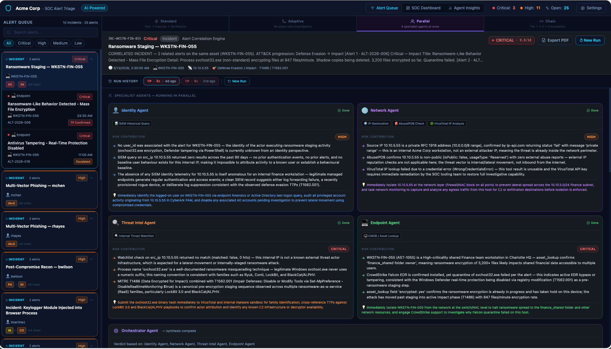
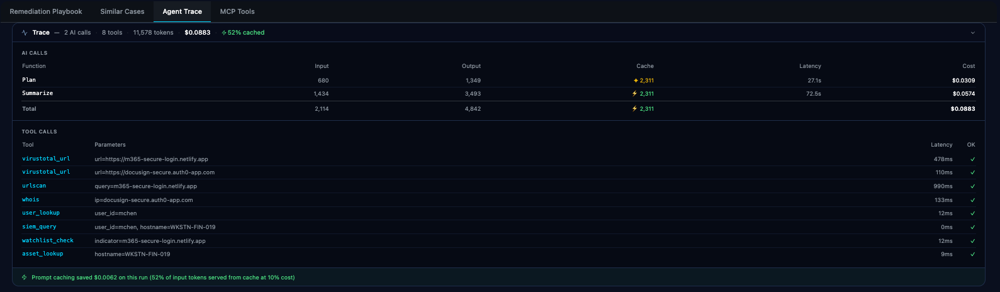
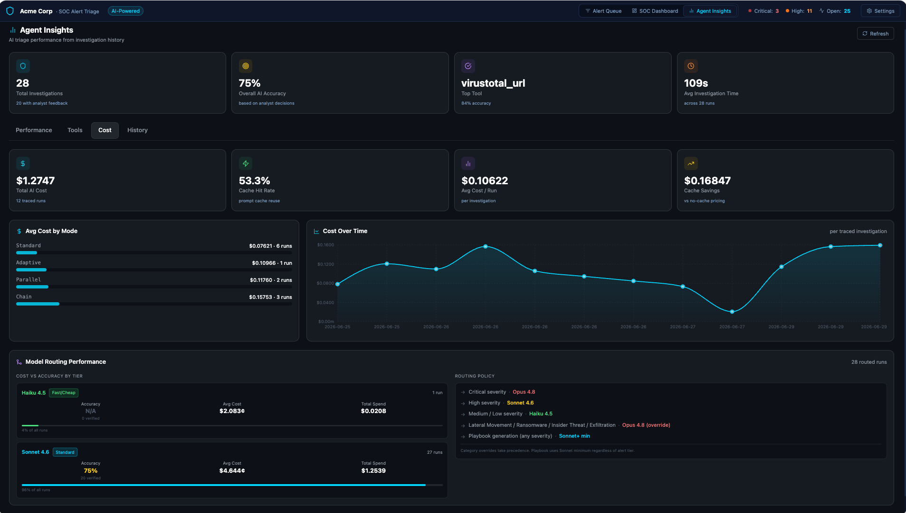
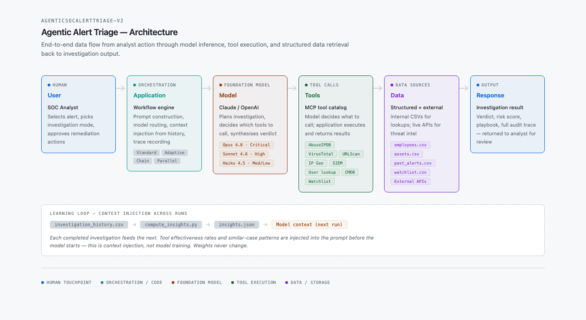

# Agentic Alert Triage

*A working prototype exploring AI-driven security investigations—not a production security product.*

AI models can investigate security alerts. But making that reliable, auditable, and useful to a SOC team turns out to require a lot more than a good prompt.

This prototype is a hands-on exploration of what it takes to build trustworthy AI-driven investigations in practice—built to surface the hard product decisions rather than simply demonstrate AI capabilities.

---

## What This Explores

- **Investigation workflows** — four orchestration patterns for the same alert, and when each is appropriate
- **Human-in-the-loop controls** — which decisions require analyst approval before any action is taken, and how that boundary is enforced
- **Agent memory** — how investigation history and past verdicts feed forward to improve future investigations
- **Evaluation and feedback loops** — tracking verdict accuracy, tool effectiveness, and investigation quality over time
- **Reasoning transparency** — making the agent's evidence chain visible and reviewable, not just the final verdict
- **Cost and quality governance** — per-investigation metering of AI calls, model tiers, and tool usage
- **Extensible tool layer** — a shared catalog of investigation tools any agent or analyst can call

---

## Three Perspectives

### SOC Analyst
*Running an investigation — four agents working in parallel, each with a different specialty*



Four specialist agents — Identity, Endpoint, Threat Intel, Network — investigate simultaneously. The platform synthesizes their findings into a single verdict and risk score. The analyst reviews findings and approves any recommended response actions before they are taken.

---

### Security Operations Leader
*The audit trail and cost record behind every investigation*



Every investigation records a full trace: which AI calls were made, how many tokens, what was cached, what each tool returned, and the total cost. Every tool call an analyst issues from the console is logged with parameters and results. The audit trail is built in, not bolted on.

---

### SOC Manager
*Investigation history, model cost by tier, and accuracy trends over time*



Cross-run analytics: verdict accuracy by workflow mode, cost per investigation by model tier, tool effectiveness over time, and a full investigation history table. Each completed investigation feeds the next — the system improves as history accumulates.

---

## Architecture



→ [Interactive version with light/dark mode](docs/architecture-diagram.html)

---

## Documentation

→ [Architecture and implementation details](docs/architecture.md) — three versions, tool catalog, system diagram, key files

→ [Design decisions and product thinking](docs/platform-thinking.md) — PM questions explored, design decisions, what was learned

---

## Product Investigation Series

*Part of a broader exploration of AI-powered security platform architecture.*

| | Repository | Focus |
|--|------------|-------|
| ✅ | [Connector Command Center](https://github.com/kousalya-pm/connector-command-center) | Connector ecosystem governance at scale |
| ✅ | **Agentic Alert Triage** *(this repo)* | AI-driven investigation architecture |

---

## Setup

Requires Node.js 18+ and an Anthropic API key ([console.anthropic.com](https://console.anthropic.com/settings/keys)).

```bash
npm install
```

Start three processes, each in its own terminal:

```bash
node server.js        # API proxy — port 3001
node mcp-server.js    # MCP tool server — port 3002
npx vite --port 5173  # Frontend — port 5173
```

Open [http://localhost:5173](http://localhost:5173), add your API key in Settings, select any alert, and click **Run AI Triage**.

External threat intel keys (AbuseIPDB, VirusTotal, URLScan.io) are optional — realistic simulated data is returned without them.

---

See [LICENSE](LICENSE) for terms.

*July 2026*
